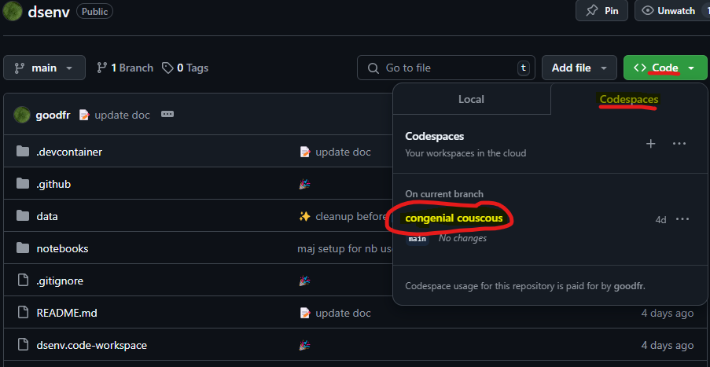

# DS env

This project aims to provide a github codespace with the required tools for data analysis and (non llm) data science with Python (this include required conda env and VSCode extension).

## Set up

### Cloud

Either use directly the codespace or fork this repository before doing so.

Launch code space via Code > Codespaces > ${name-of-codespace}



### Set up locally

VSCode is a great help for installing everything that is needed to work with devcontainer. One could clone this repository and follow the instruction from the VSCode's devcontainer extension. See the troubleshooting section if wsl needs some tweeking.

## Troubleshooting

### WSL

As [per the doc](https://learn.microsoft.com/fr-fr/windows/wsl/setup/environment), if you need to reset the user password use in powershell :

```ps1
# in ps1
wsl -u root

# in opened wsl
user=devcontainers
echo user=$user
passwd $user
```

### Docker

As per [ref](https://docs.docker.com/engine/install/linux-postinstall/), to debug lack of rights to run docker use what follows and restart VSCode.

```sh
sudo groupadd docker

USER=devcontainers
sudo usermod -aG docker $USER
newgrp docker

# test
docker run hello-world
```

## Reproducibility

One can recreate the python environment using conda with either of the command :

```bash
# OS independent - based on installation history
conda env create --name myenv --file environment.yml

# or for exact reproducibility (OS dependent)
conda create --name myenv --file spec-file.txt
```

## How to recreate the environment files

* Use bash to avoid headache of writing utf-8 with powershell...
* ⚠️ beware of the headache that `conda-env` vs `conda` could be ([doc on manage-environments](https://docs.conda.io/projects/conda/en/latest/user-guide/tasks/manage-environments.html#building-identical-conda-environments))
* `spec-file.txt` is platform specific (here Windows...)

```sh
# when starting using conda-env use it twice...
conda env export --from-history > environment.yml # environment.yml and not env.yml used by Dockerfile for build
conda env create --name test_recreate --file environment.yml

# --- test without conda-env with env.yml file KO
# conda export --from-history > env2.yml
# mamba create --name test_recreate2 --file env2.yml # ko mamba not up for bash ; ko ps1 too

# use explicit format to recreate exactly same env
conda list --explicit > spec-file.txt
mamba create --name myenv --file spec-file.txt

# or if only install required
conda install --name myenv --file spec-file.txt
```

or using powershell with utf8 and no BOM as [SO's answer](https://stackoverflow.com/questions/5596982/using-powershell-to-write-a-file-in-utf-8-without-the-bom) :

```ps1
$MyPath = "spec-file2.txt"
$MyFile = (conda list --explicit)
$Utf8NoBomEncoding = New-Object System.Text.UTF8Encoding $False
[System.IO.File]::WriteAllLines($MyPath, $MyFile, $Utf8NoBomEncoding)
```
